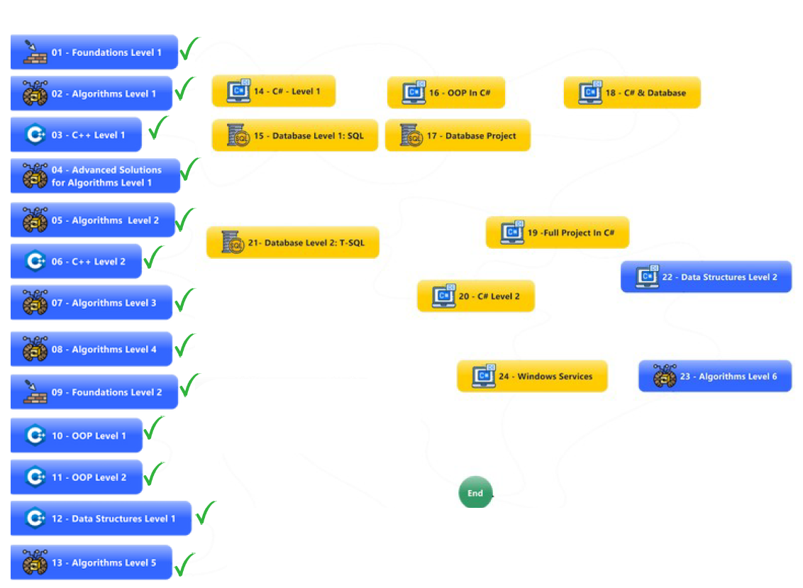

#### 01. **Foundations Level 1**

Bilgisayarın temel bileşenleri, ağ sistemleri, sayı sistemleri gibi her yazılımcının bilmesi gereken temel kavramlar üzerine odaklanıldı.

#### 02. **Algorithms Level 1**

Algoritmaların mantığına giriş yapıldı. Flowchart (akış diyagramları) ile problem çözme süreci öğrenildi. C++ ile temel algoritmalar yazıldı.

#### 03. **C++ Level 1**

Önceki kursta öğrendiğimiz algoritmalar C++ dilinde kodlandı ve temel programlama becerileri geliştirildi.

#### 04. **Advanced Solutions for Algorithms Level 1**

50’den fazla problem, şimdiye kadar edinilen bilgilerle çözülerek algoritma mantığı ileri seviyeye taşındı.

#### 05. **Algorithms Level 2**

Daha büyük projeler geliştirebilmek için yeni algoritma teknikleri ve veri yapıları tanıtıldı.

#### 06. **C++ Level 2**

Yeni öğrenilen kavramlar 100 farklı problem üzerinde uygulandı. Kurs sonunda kapsamlı bir banka uygulaması (1. versiyon) geliştirildi.

#### 07. **Algorithms Level 3**

Karmaşık problemler üzerinde çalışıldı (70 farklı senaryo). Kurs sonunda banka uygulamasının 2. versiyonu geliştirildi.

#### 08. **Algorithms Level 4**

Yazılımcılar için önemli olan ileri düzey teorik bilgiler (Mesh Network, API, protokol kavramları vb.) öğrenildi.

#### 09. **Foundations Level 2**

C++ diliyle nesne yönelimli programlamaya (OOP) giriş yapıldı.

#### 10. **OOP Level 1**

Önceki kursta fonksiyonel olarak geliştirilen banka uygulaması, bu kez nesne yönelimli prensiplerle yeniden yazıldı.

#### 11. **OOP Level 2**

Nesne yönelimli programlama konuları daha derinlemesine işlendi.

#### 12. **Data Structures Level 1**

Veri yapıları (liste, yığın, kuyruk vb.) teorik ve pratik olarak öğrenildi. Problemlerle pekiştirildi.

#### 13. **Algorithms Level 5**

12.kursta öğrendiğimiz kavramları problemlerle pekiştirdik.

#### 14. **C# Level 1**

--Devam ediyor--

