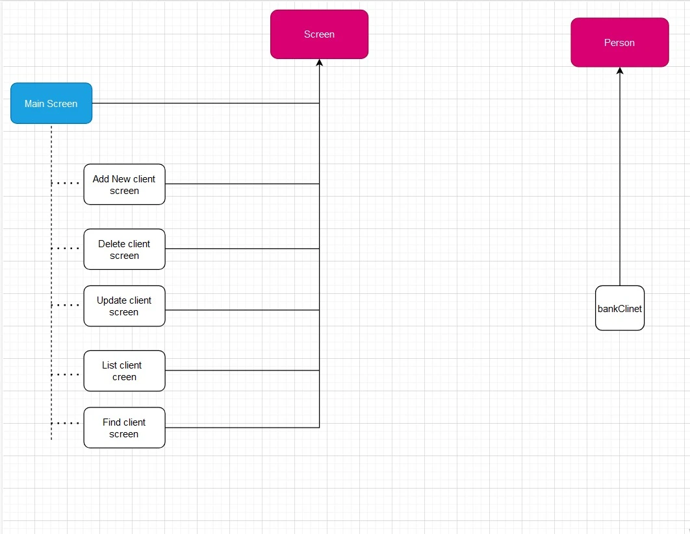

# Bank Client Management System (OOP Version)

This project operates with the same core logic as the previous  [Bank Project](https://github.com/ibrahimAgrud-2/cpp_projects/tree/master/11_bankProject) .No new features have been added, so it is highly recommended to review the previous project for a better understanding of this one.

The main purpose of this project is to rewrite the program using the fundamental principles of Object-Oriented Programming (OOP) in C++, such as **encapsulation**, **abstraction**, **inheritance**, and **polymorphism**. By leveraging these powerful concepts, the codebase has been restructured for improved clarity, modularity, and maintainability.

## How It Works

This program manages client information stored in a local file using a `bankClient` class, which is derived from the `person` class. Client-related operations—such as adding, deleting, updating, and listing clients—are implemented as separate screens. Each screen is derived from a base class called `clsScreen`.

All screens are accessed through a `mainScreen` class, which itself inherits from `clsScreen`. The `mainScreen` utilizes a **switch-case mechanism** to navigate between the different screens. This approach allows us to manage all screens centrally, simplifying navigation and maintenance.

The diagram provided above illustrates the general structure of the project. It highlights the inheritance relationships and the modular nature of the system.

## Folder Structure

Header files (`.h`): Each class is implemented in its own header file for clarity and organization.

Utility Classes:

- **`clsInputValidate.h`**: Validates user inputs.
- **`clsDate.h`**: Provides date-related functionality.
- **`clsString.h`**: Includes string manipulation utilities.