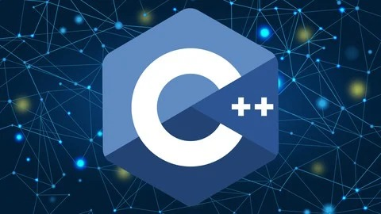

⚠⚠

This repository contains C++ projects focused on foundational programming concepts.

These projects developed with sustainability, ease of development, and extensibility in mind, allowing for future modifications and feature additions with **minimal effort**.

All projects were written using the **divide and conquer** approach to break problems into smaller, manageable parts. This method helps in structuring code more effectively and understanding problem-solving strategies better.

Additionally, please note that these projects may contain bugs or errors.
